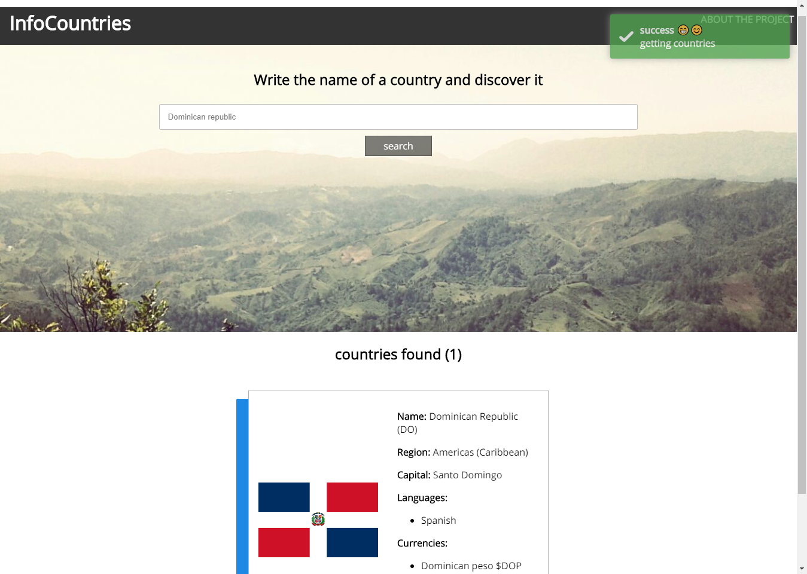

# infoCountries

Only a simple web page to fetch some data from REST Countries with vue and nodejs.
[website](https://info-countries.herokuapp.com)

created with:

* vue
* vue-router
* vue-toasted
* nodejs/express
